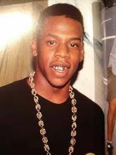
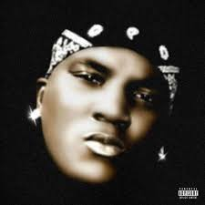
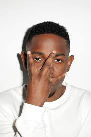
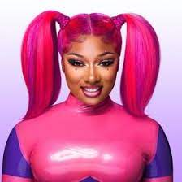
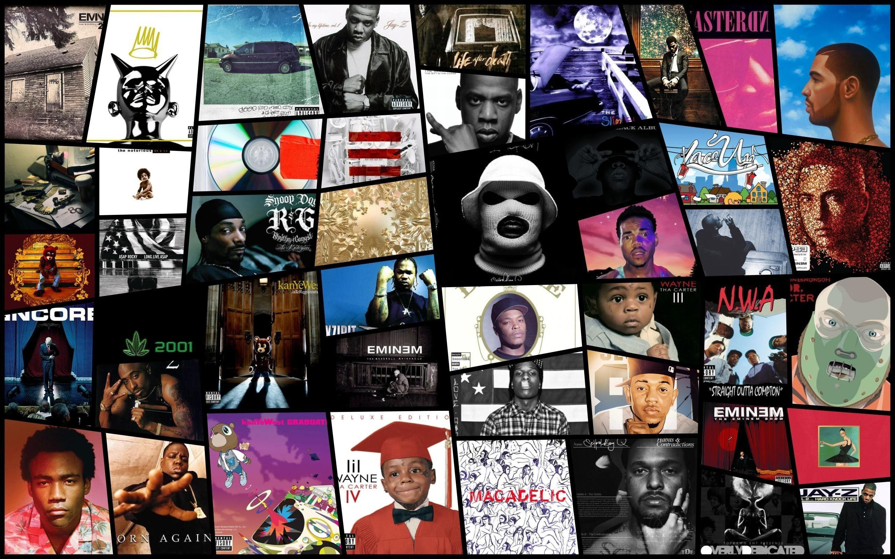

# Hip Hop Squares Game - README

## Welcome to Hip Hop Squares - The Ultimate Hip Hop Tic-Tac-Toe Showdown!

Get ready to drop beats, make moves, and dominate the board in this funky twist on the classic game of tic-tac-toe. Choose your favorite hip-hop artist as your avatar and outsmart your opponent in a rhythm-infused battle of wits. It's not just a game; it's a vibe, a groove, and a chance to prove who's the true hip-hop mastermind!

## Table of Contents

- [Technologies Used](#technologies-used)
- [Introductory Concept](#introductory-concept)
- [The Legendary Lineup](#the-legendary-lineup)
- [Wireframe](#wireframe)
- [User Stories](#user-stories)
- [Planning and Development Process](#planning-and-development-process)
- [Bronze, Silver, and Gold Plans](#bronze-silver-and-gold-plans)
- [Development Journey](#development-journey)
- [Gameplay Highlights](#gameplay-highlights)
- [Unsolved Problems](#unsolved-problems)
- [Favorite Code Highlights](#favorite-code-highlights)
- [Outro](#outro)

## Technologies Used:

- **Front-end:** HTML, CSS, JavaScript
- **Back-end:** Node.js, Express.js
- **Hosting:** GitHub Pages
- **Version Control:** Git, GitHub
- **Charset Emoji Reference:** [Emoji Cheat Sheet](https://www.w3schools.com/charsets/ref_emoji.asp)
- **Select2 Library:**[Select 2](https://select2.org/)

---

## Introductory Concept:

Hip Hop Squares isn't just your regular tic-tac-toe game; it's a high-energy showdown where the power of hip-hop meets strategic gameplay. Imagine choosing your avatar from a lineup of hip-hop legends, each with their own superpowers that can turn the tide of the game. You'll battle it out with your opponent, dropping beats and claiming squares, all while vibing to the rhythm of the game. It's a celebration of hip-hop culture and a chance to prove your lyrical prowess extends beyond the mic.


---

## THE LEGENDARY LINEUP 
**Rapper:** Jay-Z

- **Superpower:** "Rhyme Time" - Able to guess the next line of any song instantly.

**Rapper:** Cardi B

- **Superpower:** "Bardi Boost" - Receives a power-up to make multiple moves in a turn.

**Rapper:** Young Dolph

- **Superpower:** "Bulletproof" - Can protect chosen squares from being taken by the opponent.

**Rapper:** Drake

- **Superpower:** "Champagne Papi" - Can switch places with an opponent's marker.

**Rapper:** Jeezy

- **Superpower:** "Snowman Strategy" - Can rearrange the layout of the board once per game.

**Rapper:** Kendrick Lamar

- **Superpower:** "Lyrical Genius" - Can block an opponent's move by answering a trivia question.

**Rapper:** Nipsey Hussle

- **Superpower:** "Marathon Mindset" - Can strategize a winning move ahead of time.

**Rapper:** Megan Thee Stallion

- **Superpower:** "Hot Girl Energy" - Can distract the opponent with powerful charisma.

---
## Wireframe:


## Insipration: 


---

## User Stories:

1. **Choose Rapper Avatar:** As a player, I want to choose a rapper avatar before starting the game so that I can represent my favorite artist.

2. **Take Turns:** As a player, I want to take turns with my opponent to select squares on the game board so that we can compete in a game of tic-tac-toe.

3. **Real-Time Updates:** As a player, I want to see the updated game board in real-time after each move so that I can strategize and plan my next move accordingly.

4. **Winning Notification:** As a player, I want to receive a visual and audio notification when I win the game by achieving a winning combination of squares, enhancing my sense of accomplishment.

5. **Draw Scenario:** As a player, I want the game to detect when no player achieves a winning combination and declare the game as a draw, prompting us to play another round.

6. **User-Friendly Interface:** As a user, I want the game to have a user-friendly and intuitive interface so that I can easily understand the rules and interact with the game board.

7. **Leaderboard:** As a player, I want to be able to view a leaderboard displaying the top scores, motivating me to aim for a higher rank in future games.

8. **Accessibility:** As a user with disabilities, I want the game to be accessible through keyboard navigation and screen reader compatibility so that I can enjoy the game regardless of my abilities.

9. **Visual Design:** As a player, I want the game to have a visually appealing design and incorporate hip-hop-themed elements to enhance my engagement and enjoyment.

10. **Social Sharing:** As a player, I want to be able to share my victory on social media platforms, allowing me to showcase my achievement and encourage others to play.

---

## Planning-and-development-process

### Phase 1: Organize Code

- **Player Avatars:** Populate dropdowns `player1-avatar` and `player2-avatar` with rapper names and emojis.
- **Initialization:** Set default values for dropdowns when the page loads.
- **Game State and Logic:**
  - `currentPlayer`: Track whose turn it is (Player 1 or Player 2).
  - `gameBoard`: Represent the game board's state (empty, X, or O).
  - `winner`: Track the current winner (Player 1, Player 2, or null for no winner).
  - `isGameOver`: Check if the game is over.
  - `totalMoves`: Keep track of the total number of moves played.
- **Players and Avatars:**
  - `player1`: Object with info about Player 1 (name, avatar, wins).
  - `player2`: Object with info about Player 2 (name, avatar, wins).
  - `avatarEmojis`: Object mapping avatars to emojis.
- **DOM Elements:**
  - `startButton`: Reference to Start Game button.
  - `replayButton`: Reference to Replay button.
  - `player1AvatarDropdown`: Reference to Player 1's avatar dropdown.
  - `player2AvatarDropdown`: Reference to Player 2's avatar dropdown.
  - `squares`: References to individual game board squares.
  - `hallOfFameTable`: Reference to the Hall of Fame table.
- **Others:**
  - `winningCombinations`: Array of arrays representing winning combinations.
- **Game Functions:**
  - `initializeGame()`: Set up initial game state and UI.
  - `startGame()`: Start a new game on Start Game button click.
  - `replayGame()`: Replay the game on Replay button click.
  - `handleMove()`: Handle player's move (placing X or O).
  - `checkForWinner()`: Check for a winner after each move.
  - `updateScoreboard()`: Update scoreboard with player wins.
  - `updateHallOfFame()`: Update Hall of Fame table with player stats.

### Phase 2: Game Logic Implementation

- **Start Game:** Clicking Start Game button triggers `startGame()` to reset the game (clear board, enable dropdowns, disable button).
- **Dropdowns and Buttons:** After starting, dropdowns should be disabled, and Start Game button disabled until game ends.
- **Game Board:** Game board consists of squares with appropriate classes (queried with .square).
- **Handle Moves:** Clicking squares triggers `handleMove()`, updating board, switching turns, and checking for win/draw.
- **Winner and Draw:** If player wins or game draws, call `showWinner()` or `showDraw()` to indicate result.

### Phase 3: Score Tracking and Replay

- **Update Win Counts:** Update players' win counts when a player wins.
- **Replay Button:** Provide Replay button to reset board and start new round.
- **Hall of Fame:** Update table to display players' win counts.

### Phase 4: Styling and Final Touches

- Enhance styling to capture hip-hop vibe.
- Fine-tune animations, hover effects, and visuals.
- Ensure responsive design across devices.


**Hosted Game Link:** [Hip Hop Squares Game](https://shaylawhite.github.io/Hip-Hop-Squares/)

---

## Development Journey: From Idea to Hip Hop Squares

Creating the **Hip Hop Squares** game was more than just coding; it was about weaving the rhythm of hip-hop into the classic game of tic-tac-toe. This project was a solo endeavor, fueled by my passion for both programming and the dynamic essence of hip-hop culture.

### Setting the Stage

I embarked on this journey by brainstorming ideas and sculpting the game's concept. My goal was to infuse the excitement of tic-tac-toe with the vibes of hip-hop, creating an experience that's not only engaging but also a celebration of the culture.

### Sketching the Vision

To bring this vision to life, I began sketching wireframes that outlined the game's layout and interactions. These wireframes became my North Star, guiding the development of an intuitive and user-friendly interface that would resonate with players.

### Agile Steps

I embraced an Agile-inspired approach, breaking down the development into manageable tasks. I meticulously organized my tasks in a `PlanningDocument.txt` file, ensuring that every aspect of the game was accounted for in my journey.

### Conversations with Myself

Communication became a cornerstone of my progress, despite being a solo endeavor. Regular self-check-ins and reflections served as virtual standup meetings, enabling me to stay on track, share insights, and tackle challenges head-on.

### Conquering Challenges

While the journey was mine alone, challenges were inevitable. Crafting real-time interactions and ensuring a responsive UI across devices demanded innovative solutions. I delved into research, tapped into available documentation, and honed my skills to overcome each hurdle.

### Triumph Over Challenges

The result? A victorious finish over challenges, with each one adding to my learning journey. This project highlighted the power of persistence, adaptability, and the individual's capacity to conquer technical obstacles.

---

## 🥉 Bronze, 🥈 Silver, and 🥇 Gold Plans:

### 🥉 Bronze Plan
1. **Big Goals**
   - Build a web application from scratch, without a starter codebase. ✅
   - Implement game logic for a simple game like Tic Tac Toe. ✅
   - Separate HTML, CSS, and JavaScript files in your application. ✅
   - Create a dynamic game that allows two players to compete from the same computer. ✅
   - Craft a comprehensive README.md file to explain your app to the world. ✅

### 🥈 Silver Plan
1. **Apply CSS styles to enhance the game's visual appearance.** ✅
2. **Add animations and hover effects to avatars and cells.** ✅
3. **Customize styling based on the selected rapper avatars.** ✅
4. **Integrate sound effects and music:**
    - Incorporate sound effects for moves and button clicks. ✅
    - Test sound and music across different scenarios. ✅
    - When user click another square. DJ Khaled says: ANOTHER ONE  ✅


### 🥇 Gold Plan
1. **Implement Additional Features:**
   - Banner and welcoming CSS that give the game a Hip Hop Vibe ✅
   - Add a Battleground Area for players to face off head to head ✅
   - Integrate a trophy case to display achievements. Hall of Fame (Pending)
   - Create player ranks based on the number of wins. (Pending)
   - Add customization options for background and fonts. (Pending)
   - Introduce dynamic grid sizing or alternate win patterns. (Pending)
   - Integrate audio playback for each player's victory. (Pending)


---

## Hip Hop Squares Preview


Curious to see the game in action? Check out this video to get a taste of the vibrant, engaging, and rhythm-infused world of **Hip Hop Squares**!

Take a sneak peek at the electrifying moments that **Hip Hop Squares** has to offer:

### 1. Gameplay Highlights


See players selecting rappers, starting the game, and the game correctly displaying a draw result

### 2. Replay and Winner Showcase


Observe how the replay button resets the board and displays the winner's name on the scoreboard.

### 3. Replay Button in Action


Watch how the replay button resets the game board and lets players select rappers with their unique emojis.


## Highlights of the Preview:
- **Winner Display:** Watch in awe as the victory screen lights up, announcing the hip-hop mastermind of the game.
- **Scoreboard:** Stay updated with the leaderboard that showcases the top players' scores in the true spirit of competition.
- **Draw Scenario:** Experience the thrill of a tie, where the game acknowledges a draw and sets the stage for another round of intense hip-hop tic-tac-toe.
- **Rapper Selection:** Feel the power of choice as you pick your favorite rapper avatar, each with a unique superpower to bring a strategic edge to the game.
- **Superpowers:** Witness the magic of each rapper's superpower, from altering appearances to guessing song lyrics in an instant, all adding a touch of hip-hop flair.
- **Start Game and Replay:** Engage seamlessly with the "Start Game" button and bask in the satisfaction of the "Replay" option for endless rounds of fun.
- **UI Styling:** Immerse yourself in the captivating hip-hop-themed UI, where every element is carefully designed to groove with the rhythm of the game.

---

## Unsolved Problems

In future iterations of the game, we plan to address the following issues:
- Enhance real-time interactivity between players.
- Implement a leaderboard to track high scores.
- The Hall of Fame Counter
- Improve accessibility for users with disabilities.
- Optimize the game for different screen sizes and devices.

---

## Favorite Code Highlights

I wanted to highlight a couple of my favorite code snippets that brought the **Hip Hop Squares** game to life:

1. One of my favorite functions is the `showWinner()` function. This function displays the winner of the game and was a challenging part to get working correctly. I'm proud to have figured it out:

    ```javascript
    function showWinner(player) {
        const selectedRapperName = player === player1 ? player1AvatarDropdown.value : player2AvatarDropdown.value;

        // Display a message that the player has won along with the rapper's name
        currentWinnerName.innerHTML = `🎉 Congrats ${player.name} you win!🎉 <br>${selectedRapperName} IS THE TOP MC! 🎤`;

        player.wins++;
        updateScoreboard();
    }
    ```

2. I also had fun creating a mapping of rapper names to emojis, adding a touch of hip-hop flair to the game:

    ```javascript
    const rapperEmojis = {
        Drake: '🦉',
        Kendrick: '🥷',
        CardiB: '💰',
        JayZ: '🐐',
        Nipsey: '🏁',
        MeganTheeStallion: '🐎',
        Jeezy: '❄️',
        Dolph: '🐬',
        SnoopDogg: '🌿',
    };
    ```

---

## Outro

I hope you've enjoyed exploring the dynamic world of **Hip Hop Squares**. I'm continuously working on enhancing the game and creating a groovy user experience. Your feedback and support are invaluable as I keep grooving forward. Thank you for joining me on this exciting journey of rhythm, strategy, and hip-hop fun!


 
